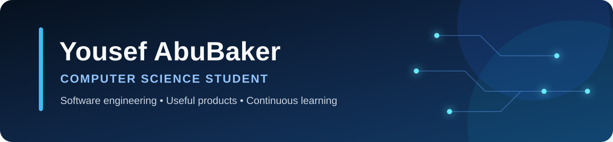

<div align="center">
  
</div>

<p align="center">
  <a href="https://www.linkedin.com/in/yousefwalidabubaker/"></a>
  <a href="https://github.com/yousefwalidabubaker/CampusFlow"></a>
</p>

## About me

I am a fourth year Computer Science student at An Najah National University. I enjoy connecting software engineering fundamentals with real problems, from university event coordination to e commerce and inventory systems.

My strongest work combines clear requirements, useful interfaces, reliable backend logic, and teamwork. I am currently strengthening my full stack development skills and looking for opportunities where I can learn from experienced engineers while contributing from day one.

## Selected work

<table>
  <tr>
    <td width="50%" valign="top">
      <h3><a href="https://github.com/yousefwalidabubaker/CampusFlow">CampusFlow</a></h3>
      <p>A full stack platform for managing university events, registrations, and capacity.</p>
      <p><strong>Built with:</strong> HTML, CSS, JavaScript, Node.js, Express, SQLite</p>
      <p><strong>Engineering focus:</strong> REST APIs, validation, database transactions, integration tests</p>
    </td>
    <td width="50%" valign="top">
      <h3><a href="https://github.com/yousefwalidabubaker/MIN-HON">MIN HON</a></h3>
      <p>A bilingual Palestinian heritage shopping experience with customization and an AI concierge.</p>
      <p><strong>Role:</strong> Technical Team Leader</p>
      <p><strong>Recognition:</strong> Second Place in the Innovate IT Hackathon AI Track</p>
    </td>
  </tr>
  <tr>
    <td width="50%" valign="top">
      <h3><a href="https://github.com/yousefwalidabubaker/BookStoreDSA">BookStoreDSA</a></h3>
      <p>A Java bookstore system built around custom data structures and clear business rules.</p>
      <p><strong>Core concepts:</strong> Hash tables, binary search trees, linked queues, testing</p>
    </td>
    <td width="50%" valign="top">
      <h3>Wafeer</h3>
      <p>An AI powered marketplace concept designed to reduce losses from near expiry food products.</p>
      <p><strong>Role:</strong> Project Manager</p>
      <p><strong>Recognition:</strong> Potential to Scale Award with guidance from Microsoft mentors</p>
    </td>
  </tr>
</table>

## Technical toolkit

<p>
  
  
  
  
  
  
  
  
  
  
  
</p>

## Highlights

* Potential to Scale Award for Wafeer at the International TechBridge Hackathon
* Second Place in the AI Track for MIN HON at the Innovate IT Hackathon
* Former Head of Activities and President of the IT Community within Engineers Without Borders
* Mentored students in advanced problem solving and taught introductory Python and Arduino

## What I value in software

```text
Clear requirements  |  Useful interfaces  |  Reliable logic  |  Continuous learning
```

<p align="center">
  <strong>Open to software engineering and technology internship opportunities</strong>
</p>
