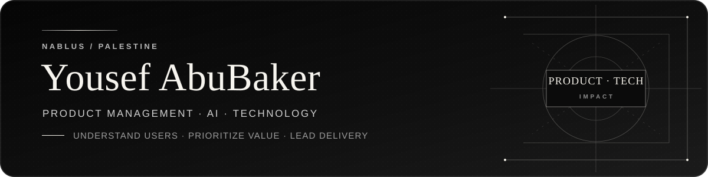

  

  
  

<table>
  <tr>
    <td width="33%" align="center"><strong>2</strong> Hackathon awards</td>
    <td width="33%" align="center"><strong>3</strong> Public projects</td>
    <td width="33%" align="center"><strong>2027</strong> Expected graduation</td>
  </tr>
</table>

## About me

I am a fourth year Computer Science student at An Najah National University focused on software engineering, AI enabled products, and dependable backend logic. I enjoy taking a real problem from requirements to a working product and keeping the result useful, clear, and testable.

Alongside development, I have led award winning hackathon teams, coordinated technology communities, and learned directly from Microsoft mentors. I am looking for an internship where I can contribute, learn from experienced engineers, and keep shipping practical work.

## Current focus

| | |
|---|---|
| **Building** | Full stack systems with REST APIs, databases, validation, and tests |
| **Strengthening** | Backend engineering, software design, Azure, and AI integration |
| **Looking for** | Software engineering, AI, and technology internships |

## Selected work

<table>
  <tr>
    <td width="50%" valign="top">
      <h3><a href="https://github.com/yousefwalidabubaker/CampusFlow">CampusFlow</a></h3>
      
A full stack platform for managing university events, registrations, and capacity.

      
<strong>Built with:</strong> HTML, CSS, JavaScript, Node.js, Express, SQLite

      
<strong>Engineering focus:</strong> REST APIs, validation, database transactions, integration tests

    </td>
    <td width="50%" valign="top">
      <h3><a href="https://github.com/yousefwalidabubaker/MIN-HON">MIN HON</a></h3>
      
A bilingual Palestinian heritage shopping experience with customization and an AI concierge.

      
<strong>Role:</strong> Technical Team Leader

      
<strong>Recognition:</strong> Second Place in the Innovate IT Hackathon AI Track

    </td>
  </tr>
  <tr>
    <td width="50%" valign="top">
      <h3><a href="https://github.com/yousefwalidabubaker/BookStoreDSA">BookStoreDSA</a></h3>
      
A Java bookstore system built around custom data structures and clear business rules.

      
<strong>Core concepts:</strong> Hash tables, binary search trees, linked queues, testing

    </td>
    <td width="50%" valign="top">
      <h3>Wafeer</h3>
      
An AI powered marketplace concept designed to reduce losses from near expiry food products.

      
<strong>Role:</strong> Project Manager

      
<strong>Recognition:</strong> Potential to Scale Award with guidance from Microsoft mentors

    </td>
  </tr>
</table>

## Technical toolkit

  
  
  
  
  
  
  
  
  
  
  

## Highlights

* Won the Potential to Scale Award for Wafeer at the International TechBridge Hackathon with guidance from Microsoft mentors
* Led MIN HON technical delivery to Second Place in the AI Track at a hackathon with more than 300 participants
* Led activities for an Engineers Without Borders community of more than 250 members and events reaching more than 1,000 attendees
* Co founded DSC and helped deliver more than 10 technical sessions reaching more than 500 participants
* Mentored 10 students in an advanced problem solving program serving 120 students

  <strong>Open to software engineering, AI, and technology internship opportunities</strong>

