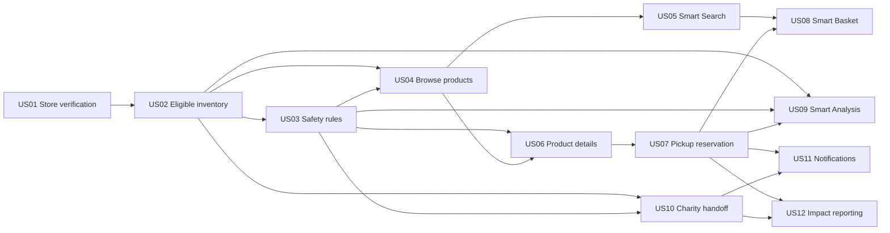

# Wafeer Product Board

This view turns the detailed Wafeer backlog into a board that a team can use during planning. It shows what must be delivered first, what depends on earlier work, and which ideas should wait until the core flows are reliable.

[Read the full Product Backlog](./WAFEER_PRODUCT_BACKLOG.md) | [Open all Wafeer Issues](../../issues?q=is%3Aissue+Wafeer)

## Product goal

Help stores act on time sensitive inventory before it becomes waste, while giving customers a trustworthy way to save money on safe food and giving verified charities enough time to collect eligible surplus.

## Release board

| Foundation | First public release | Improve after release | Learn and expand |
| --- | --- | --- | --- |
| [US01 Store verification](../../issues/1) | [US04 Product browsing](../../issues/4) | [US05 Smart Search](../../issues/5) | [US08 Smart Basket](../../issues/8) |
| [US02 Eligible inventory](../../issues/2) | [US06 Product details](../../issues/6) | [US11 Notifications](../../issues/11) | [US09 Smart Analysis](../../issues/9) |
| [US03 Safety rules](../../issues/3) | [US07 Pickup reservation](../../issues/7) |  | [US12 Impact reporting](../../issues/12) |
|  | [US10 Charity handoff](../../issues/10) |  |  |

The first two columns make up the first public release. The last two columns remain in the backlog until the team validates the core journeys and has reliable inventory data.

## Ordered backlog

| Order | Story | Epic | Priority | Target | Planning status | Depends on |
| --- | --- | --- | --- | --- | --- | --- |
| 1 | [US01 Create and verify a partner store](../../issues/1) | E1 | Must | Sprint 1 | Ready for estimation | None |
| 2 | [US02 Add eligible inventory](../../issues/2) | E1 | Must | Sprint 1 | Ready after US01 | US01 |
| 3 | [US03 Enforce food safety and eligibility rules](../../issues/3) | E1 | Must | Sprint 1 | Validate category cutoffs, then estimate | US02 |
| 4 | [US04 Browse discounted products](../../issues/4) | E2 | Must | Sprint 2 | Planned after foundation | US02, US03 |
| 5 | [US06 Review clear product and safety information](../../issues/6) | E2 | Must | Sprint 2 | Planned after foundation | US03, US04 |
| 6 | [US07 Reserve and place a pickup order](../../issues/7) | E3 | Must | Sprint 3 | Payment at pickup decision confirmed | US03, US06 |
| 7 | [US10 Route eligible surplus to verified charities](../../issues/10) | E5 | Must | Sprint 3 | Validate the charity collection window | US02, US03 |
| 8 | [US05 Find products with Smart Search](../../issues/5) | E2 | Should | Sprint 4 | Test search needs after basic browsing | US04 |
| 9 | [US11 Send useful order and safety notifications](../../issues/11) | E3 | Should | Sprint 4 | Plan after both handoff flows | US07, US10 |
| 10 | [US08 Build a Smart Basket within a budget](../../issues/8) | E4 | Should | Sprint 5 | Validate with customers first | US05, US07 |
| 11 | [US09 Prioritize inventory with Smart Analysis](../../issues/9) | E4 | Should | Sprint 5 | Needs reliable inventory and order data | US02, US03, US07 |
| 12 | [US12 Measure savings, recovery, and impact](../../issues/12) | E5 | Could | Sprint 6 | Define calculations before building reports | US07, US10 |

## Epic view

| Epic | Outcome | Stories |
| --- | --- | --- |
| E1 Store and safety foundation | Only verified stores and eligible inventory enter the platform | US01, US02, US03 |
| E2 Customer discovery and trust | Customers can find and understand an offer before reserving it | US04, US05, US06 |
| E3 Orders and fulfilment | Stock is reserved once and collected through a clear pickup flow | US07, US11 |
| E4 Smart features | Suggestions help people act without weakening safety or human control | US08, US09 |
| E5 Donation and impact | Eligible surplus reaches verified charities and completed outcomes are measured honestly | US10, US12 |

## Dependency map

## First public release journeys

### Customer journey

1. A verified store adds a product.
2. The system checks the product and applies the category safety cutoff.
3. A customer finds the product and reviews its price, date, storage, and pickup information.
4. The customer verifies contact information and reserves the item.
5. The stock is locked once, the customer pays at pickup, and the store confirms collection.

### Charity journey

1. Eligible stock remains available for normal sale until the configured selling window ends.
2. The store offers still safe and unexpired surplus to a verified charity before the donation cutoff.
3. The charity accepts all or part of the quantity.
4. Accepted stock is locked and cannot be sold or offered again.
5. The charity collects it before the cutoff.
6. Reporting counts the handoff only after collection.

## Board rules

* Safety blocks always take priority over discounts, orders, donations, and smart suggestions.
* A Must story belongs in the first public release unless the Product Owner records a new decision.
* The development team estimates the work before sprint commitment.
* A story moves into a sprint only after meeting the Definition of Ready.
* Completed outcomes are measured from pickup or collection, not from listings, reservations, or accepted offers alone.
